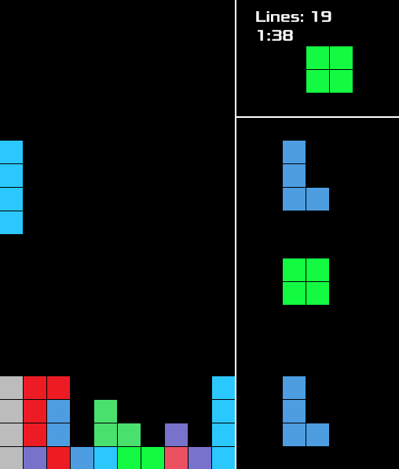

# Tetrs

Tetris in Rust using ggez.

Left/right to move, up to rotate, space to drop, c to hold, down to soft drop.



# Building and Running

To build: `cargo build --release`
To run: `cargo run --release`

A resources folder with a folder called 'fonts' containing Xolonium-Regular.ttf must be in the same folder as the binary. The fonts folder can also be in various other places in Linux such as ~/.config/tetrs or ~/.local/share/tetrs.

```
.
├── resources
│   └── fonts
│       ├── FONTLOG.txt
│       ├── LICENSE.txt
│       ├── Xolonium-Bold.ttf
│       └── Xolonium-Regular.ttf
└── tetrs
```

Compiled binaries for Windows and Linux should be in [the releases tab](https://github.com/mkhan45/tetrs/releases) of GitHub.

# Details

See [HowItWorks.md](HowItWorks.md) or run `cargo doc --open` for simpler documentation
